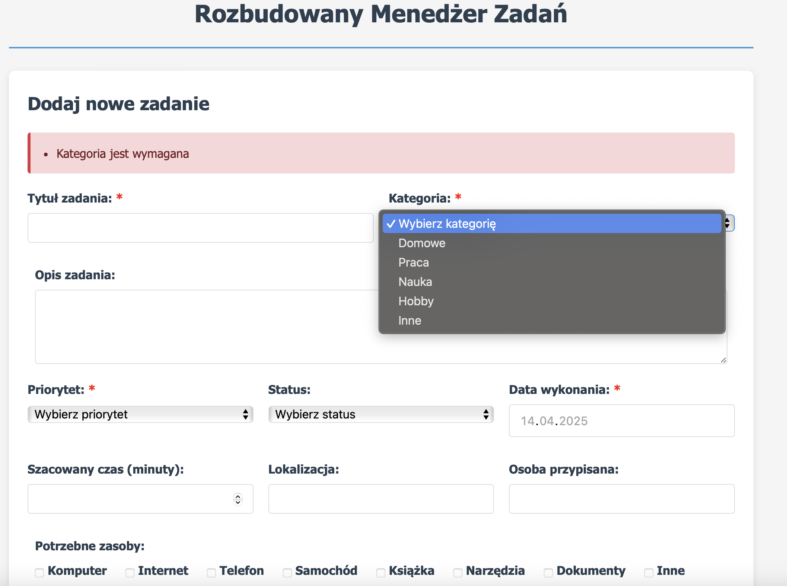

# Zadanie 10: Projekt Interfejsu "Menedżer Zadań" (HTML/CSS Grid)

## Cel Zadania
Zaprojektuj profesjonalny, responsywny formularz wejściowy, który stanie się częścią większego systemu zarządzania projektami.

## Specyfikacja techniczna
1. **Layout (CSS Grid):**
   - Zastosuj siatkę dwukolumnową dla pól danych.
   - Wykorzystaj `grid-column: 1 / -1` dla elementów o pełnej szerokości (Tytuł, Opis, Załącznik).
2. **Design System:**
   - **Alert:** Czerwona sekcja ostrzeżeń (border-left, tło, ikona ⚠).
   - **Interakcja:** Efekty `:focus` (zmiana koloru ramki i delikatny cień) oraz `:hover` dla przycisków.
3. **RWD:**
   - Media Query dla urządzeń mobilnych (szerokość < 600px): przełączenie siatki na jedną kolumnę.

## Zadanie do wykonania (Połączone kroki)
Stwórz plik `zadanie_10.html`, który odwzoruje interfejs z pliku `example.png`. Formularz musi zawierać: Tytuł, Przypisaną osobę, Daty (start/koniec), Listy rozwijane (Priorytet, Kategoria), pole liczbowe (Czas), Textarea (Opis) oraz Checkbox (Powiadomienia). Wszystkie pola muszą być powiązane z etykietami `<label>`. Zadbaj o semantykę (użyj `<header>`, `<main>`, `<footer>`).

## Wizualizacja (Wzór)

---

### Kryteria sukcesu
- Formularz jest wizualnie zgodny ze wzorem.
- Kod CSS jest osadzony w `<style>` (brak zewnętrznych bibliotek).
- Formularz poprawnie zmienia układ na mobilny.
